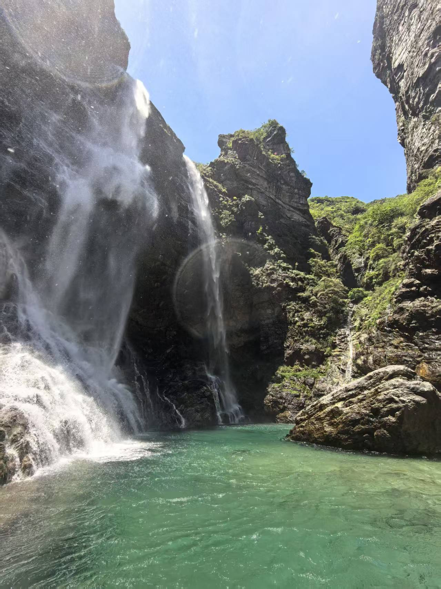
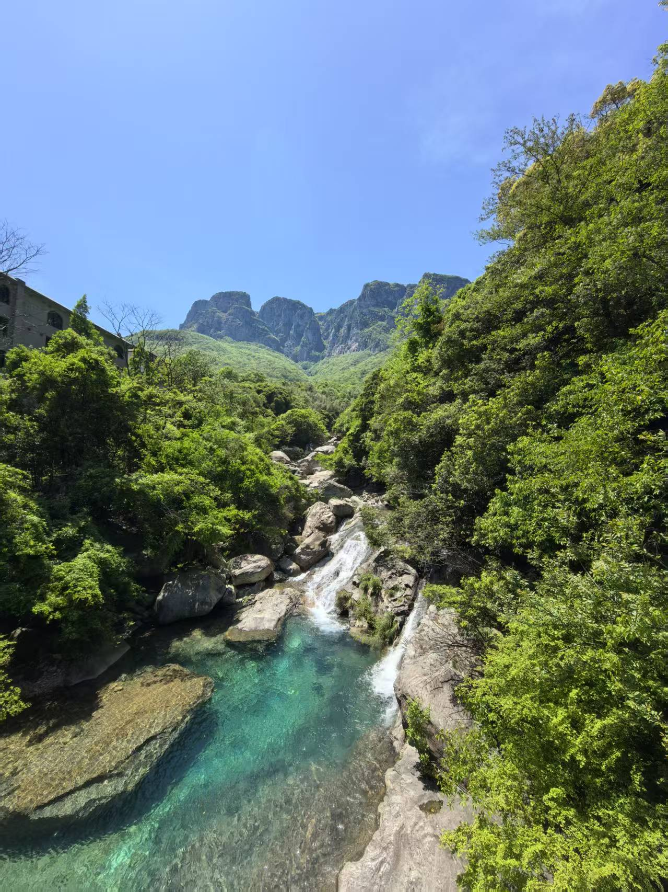
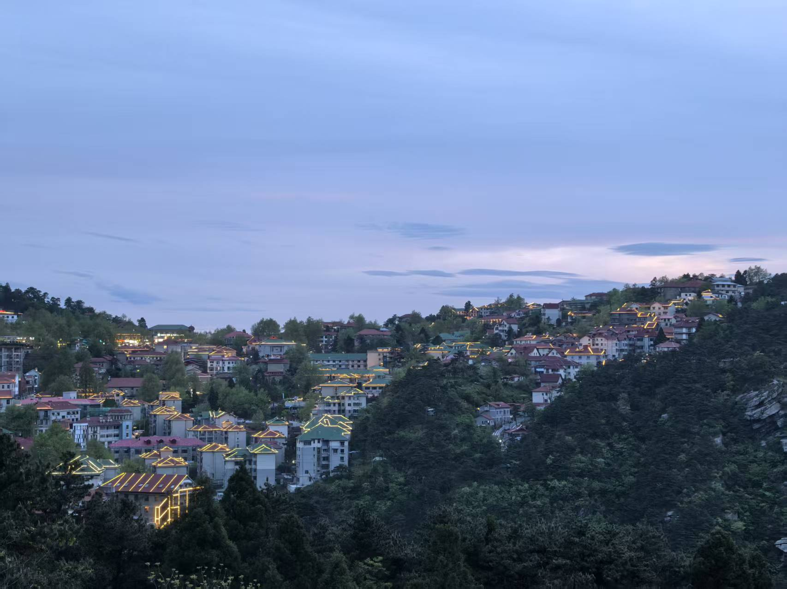
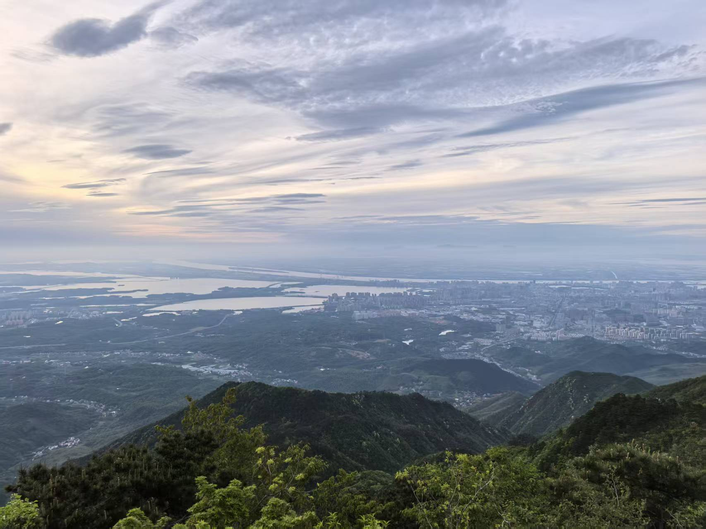
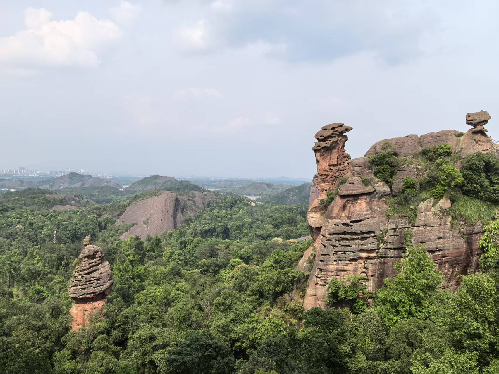
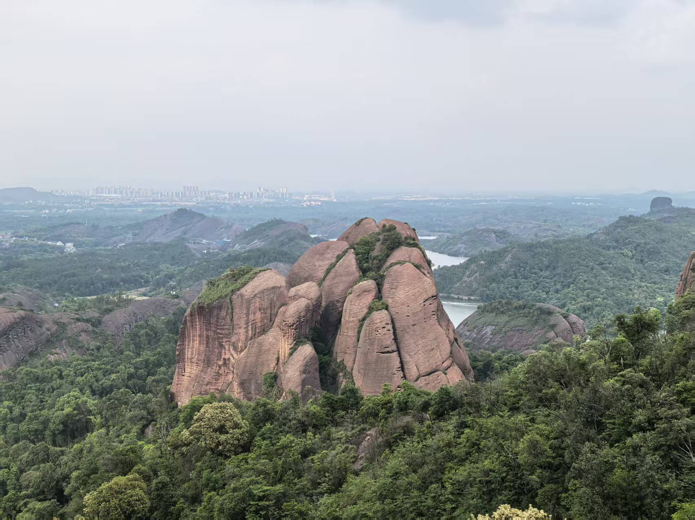
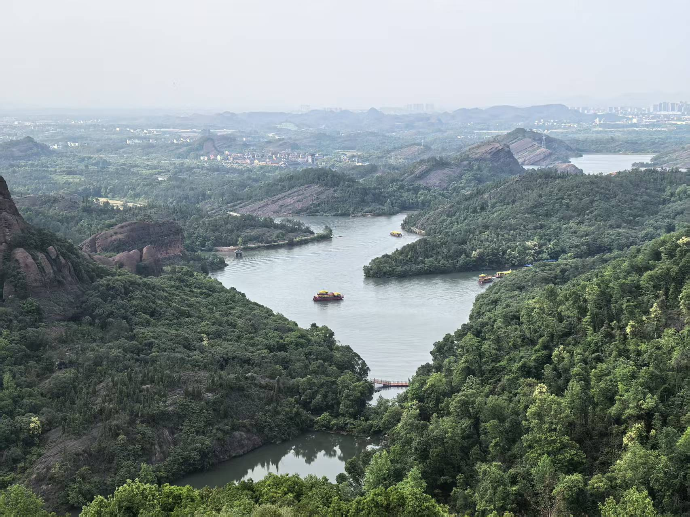
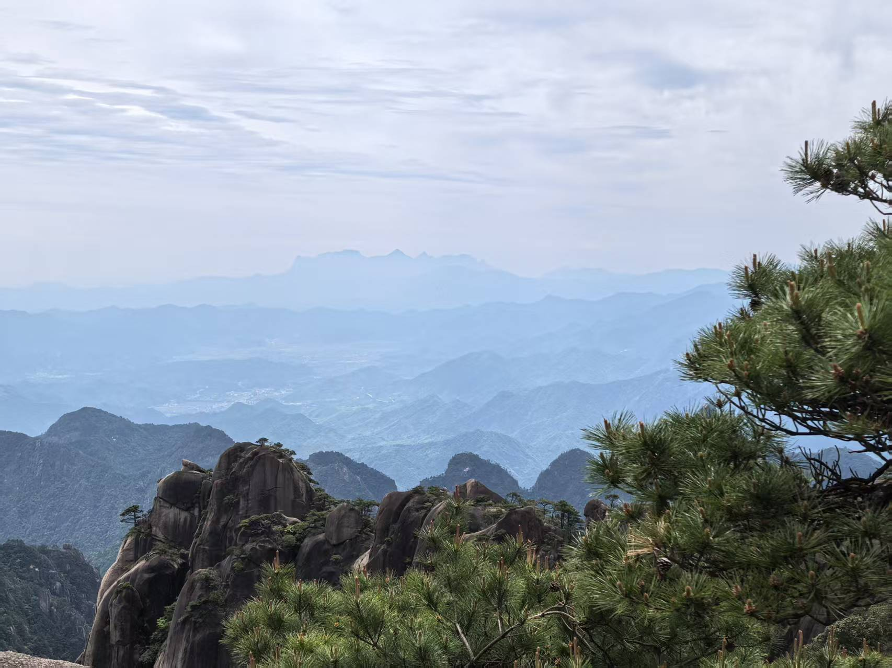
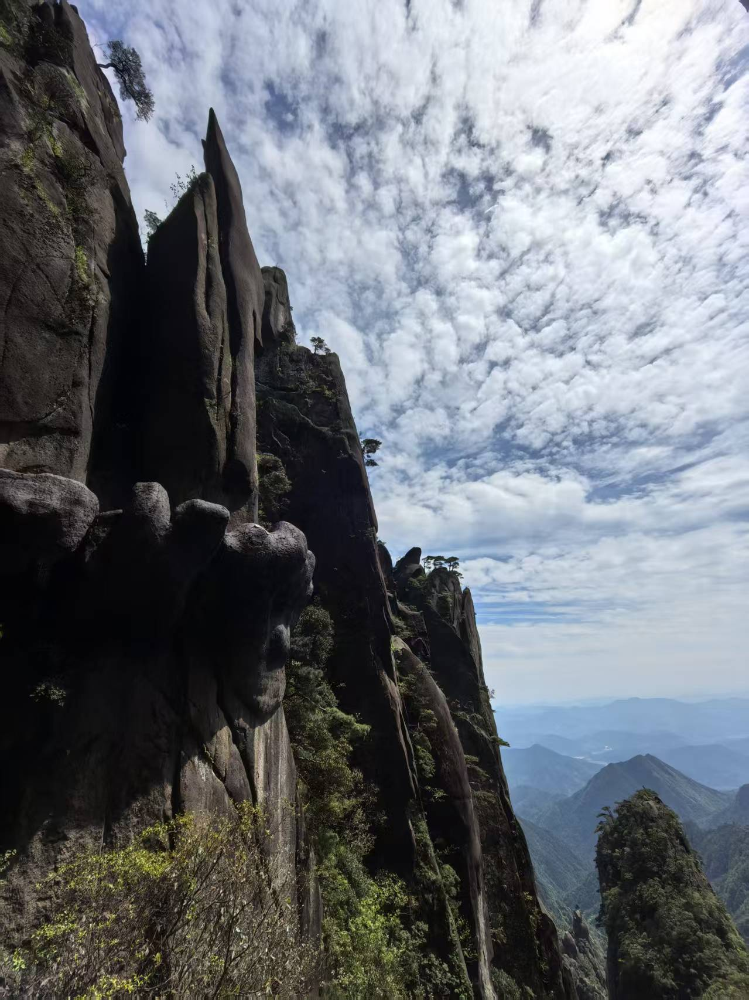
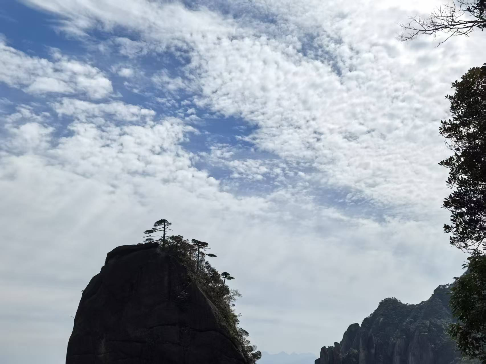

没有什么比得上在春末夏初的五一假期，逃离城市的喧嚣，去山野间寻找一片清凉更惬意的事了。这次我选择了江西，用四天的时间，走过庐山、龟峰和三清山，仿佛阅读了一部由山水写就的巨著，每一页都令人心醉。

## 一、不识庐山真面目，只缘身在此山中。

第一站，便是“匡庐奇秀甲天下”的庐山。清晨，当第一缕阳光穿透薄雾，我已经站在了三叠泉的入口。当地有句民谣：“不到三叠泉，不算庐山客。”但这“庐山客”的门票，是需要用双脚去丈量的。

下到谷底的数千级石阶，是对膝盖的第一次考验。但当那三叠瀑布真的呈现在眼前时，所有的疲惫都一扫而空。瀑布如白练当空，从高处层层跌落，水击岩石，发出雷鸣般的轰响。飞溅的水珠化作细密的雾气，沾衣欲湿。

相比于三叠泉的壮阔，下午的小天池则显得更为静谧。它藏在庐山北麓的山顶，一池碧水，清澈如镜。站在池畔的观景亭上，视野极为开阔。据说这里是观日落和云海的绝佳地点。

第二天的行程集中在大天池。与想象中的一汪碧水不同，庐山的大天池其实是寺前的两方水池，池水终年不涸，颇为神奇。水池虽不大，但大天池景区最吸引人的，是它周边险峻的山峰和深厚的人文底蕴。

## 二、石色蒸霞红甲润，苔痕湿雨绿毛垂。

告别庐山，我们前往弋阳的龟峰。这是一片典型丹霞地貌，无山不龟，无石不龟，形态各异的山石，或如神龟探海，或如金龟朝圣，惟妙惟肖，让人不得不感叹大自然的鬼斧神工。

下午的阳光热烈，照射在红色的砂岩上，让整座山体呈现出温暖的橘红色。我们乘船游览清水湖，从水上回望，那些奇峰怪石倒映在碧绿的湖水中，刚与柔、红与绿形成了奇妙的对比。微风徐来，水波不兴。

## 三、雾绕云缠听涧濑，凰歌凤舞共岩松。

行程的最后一天，也是体力挑战最大的一天，我们留给了“天下无双福地”的三清山。为了避开人群，我们选择乘坐港首索道上山。

三清山的美，是集黄山之奇、庐山之秀、华山之险于一身。我们沿着西海岸的高空栈道前行，这条修建在海拔1600多米悬崖绝壁上的栈道，堪称人间奇迹。行走其上，平步青云，一边是壁立千仞的悬崖，一边是深不可测的幽谷，远处是连绵起伏、形态万千的峰林。

夕阳西下，拖着疲惫的身躯，带着满满的回忆与震撼，坐上回程的索道。整整一天的攀爬，腿早已不听使唤，但精神却异常亢奋。

