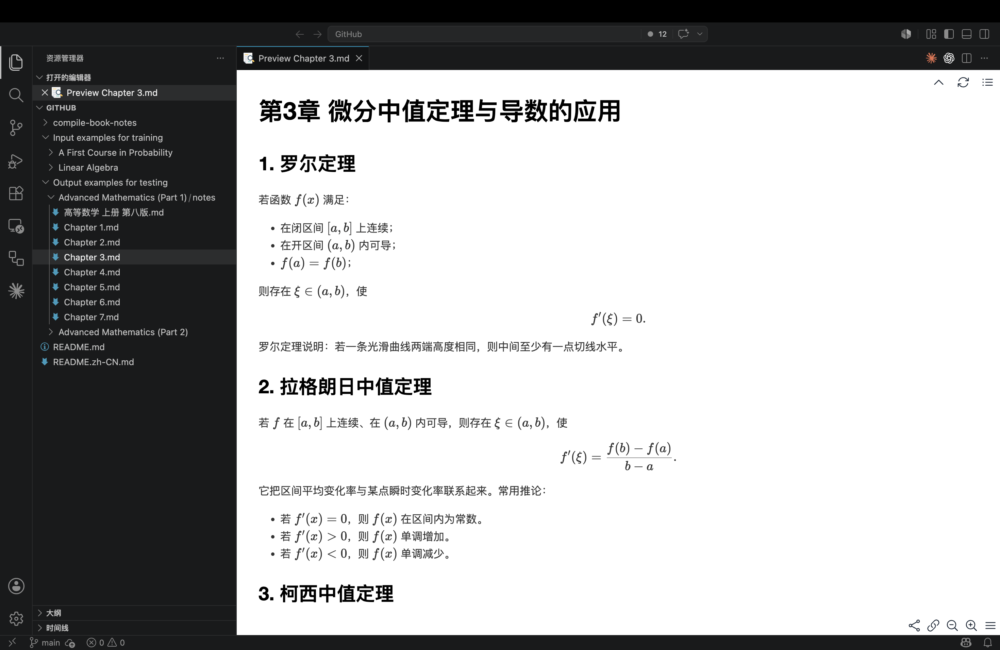
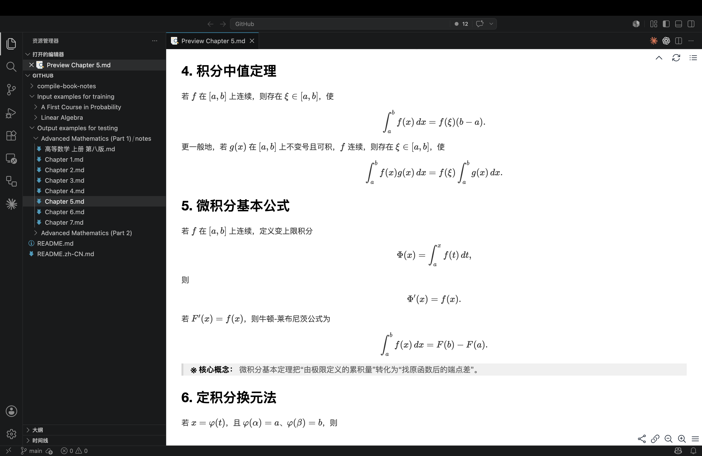
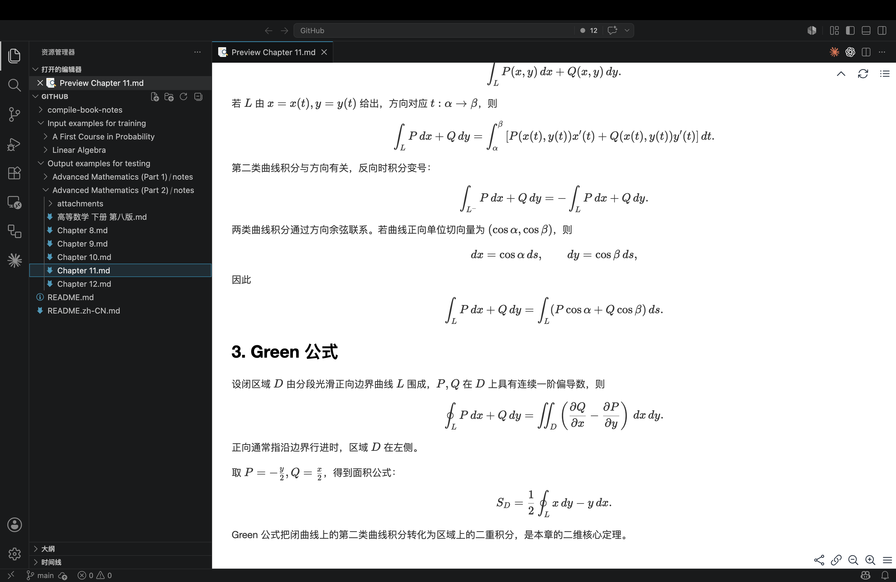
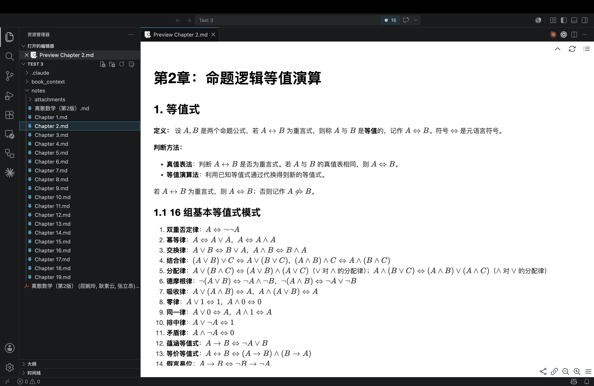
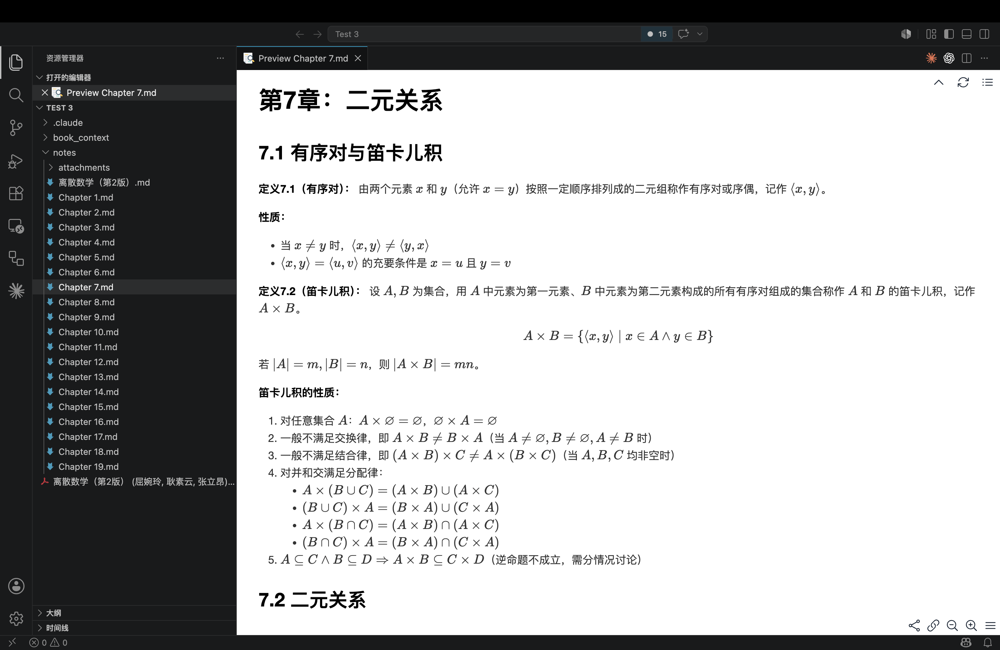
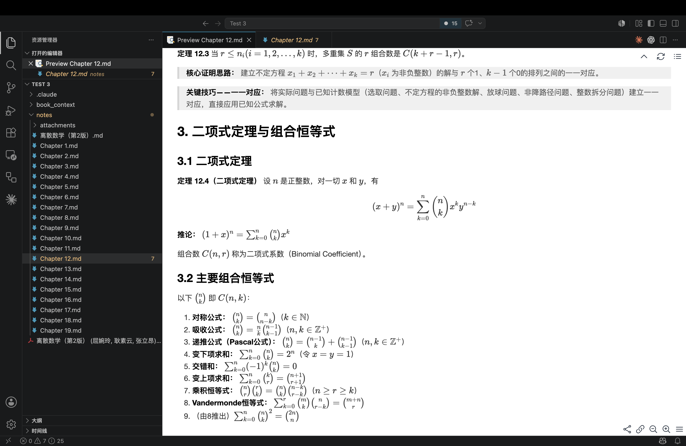

GitHub项目地址：https://github.com/Mistvillion/Compile-Book-Notes

[Compile-Book-Notes](https://github.com/Mistvillion/Compile-Book-Notes)

上学期速通离散数学的时候就在想，有没有啥高效速通的方法，最好是能整理出笔记的那种。

一直都在寻找能实现这种功能的skill：在codex中输出一本书的pdf，codex就能自动帮你按书中目录整理笔记，保存在该项目中。但是一直没找到效果好的（也可能是本人搜寻信息能力太菜了），干脆自己创建了一份skill。

（后来找到一个网站，mineru.net，也是专门整理笔记的，不过还没用过，不清楚效果好不好。）

起初，为了让整理的笔记质量更高，我列举了一大堆要求，写了一段很长很长的提示词，最后发现效果很差，和一般的笔记区别非常大，完全不像一份笔记。后来突发奇想，把我自己之前整理的线性代数与概率论的笔记给它，让它参考这两份笔记来输出，效果是不是会好一点。

我把我自己的两份案例笔记也放在GitHub仓库里面了（项目里的 Input examples for training 文件夹，包括线性代数和概率论笔记），让codex创建了一份能输出这种风格笔记的skill（项目里的 compile-book-notes 文件夹，此为完整的skill包），最后我又测试了一遍，将同济版的高数上下作为输入，得到了codex输出的笔记（项目里的 Output examples for training 文件夹，是codex整理的同济版高数笔记），发现效果还挺不错：

这是gpt5.5-pro花费10分钟整理出来的，差不多烧了4美元。随后我又用deepseek-v4-pro试了一下离散数学，就是北京大学屈婉玲老师那一版离散数学。尽管deepseek跑了30分钟才出结果，不过效果很不错，我觉得挺好的，顺带一提，deepseek只烧了2块钱，梁圣伟大！下面是deepseek的成果图：

有关skill更详细的信息都放在仓库里的README文档了，觉得不错的可以赏个star吗？谢谢啦！有什么疑问或修改意见也欢迎在评论区提出来。

最后，所有这类AI生成的笔记都仅供参考，如果想要深入研究某本书籍或某个领域，还是很有必要认真啃一遍书的。