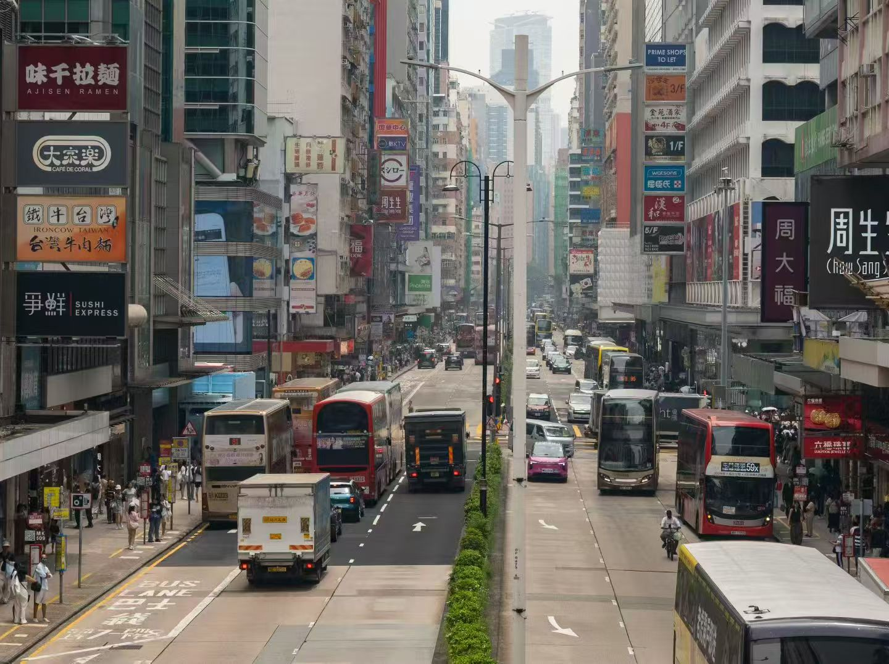
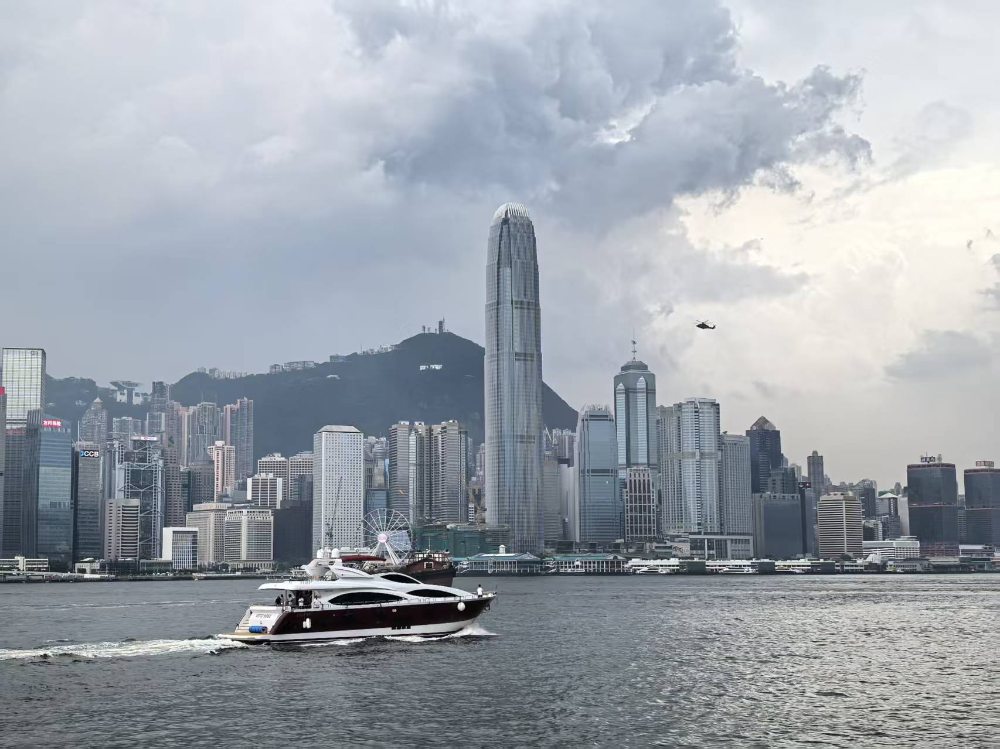
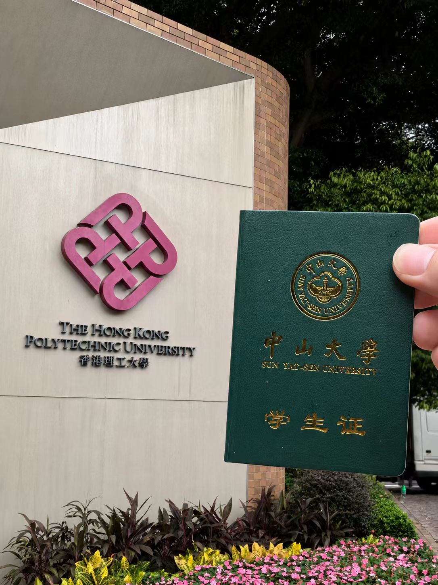
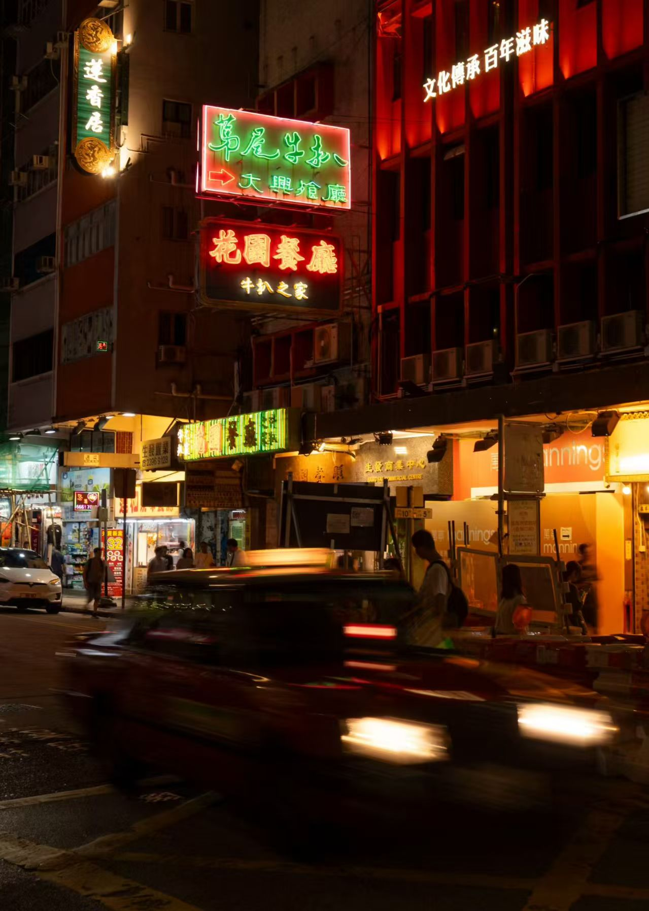
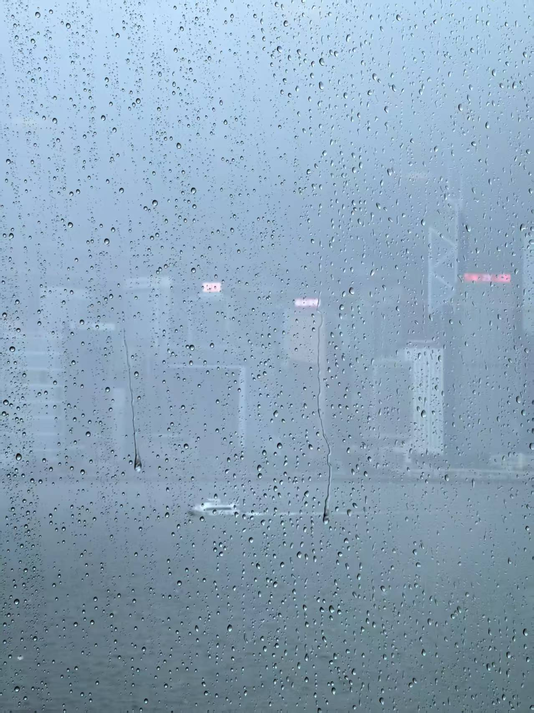
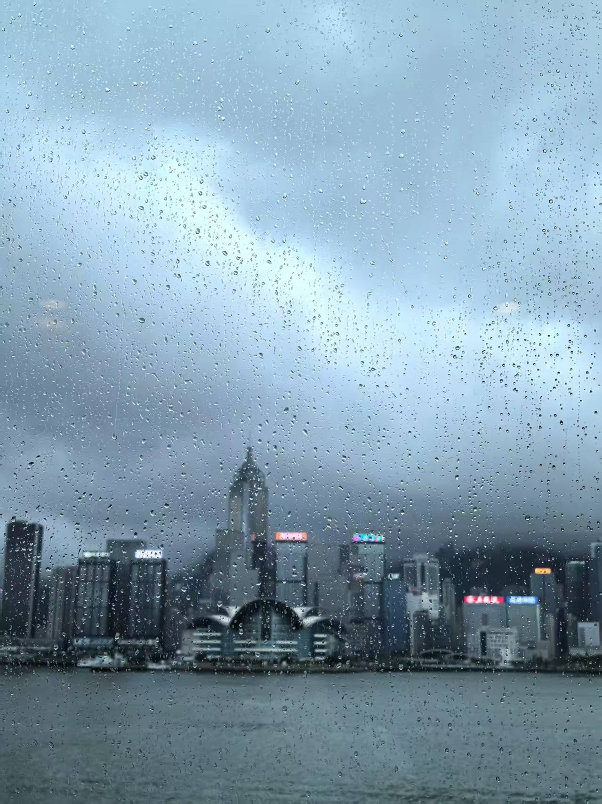
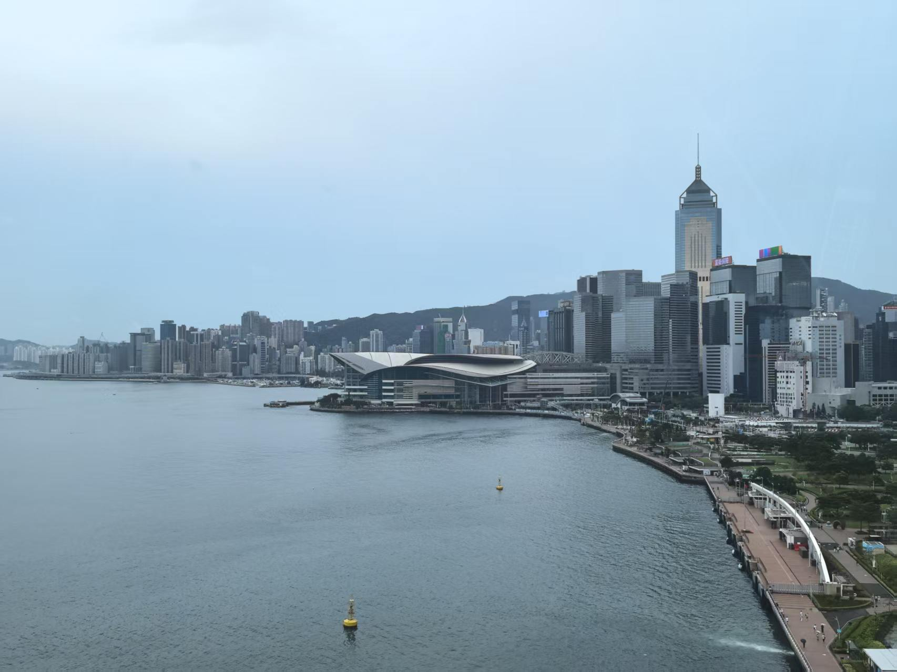
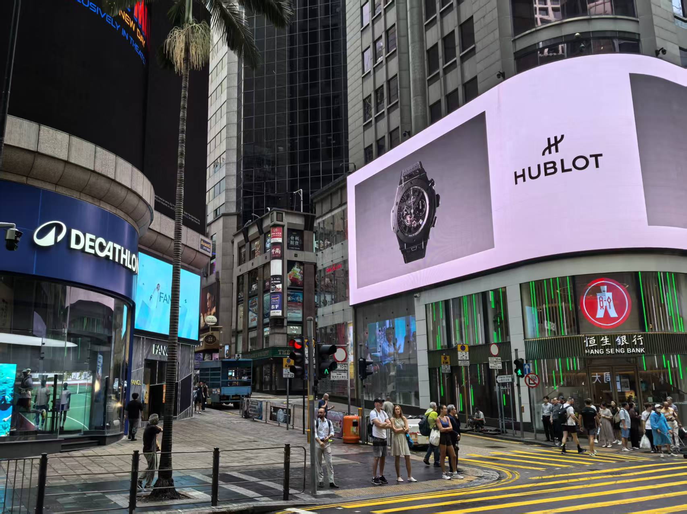
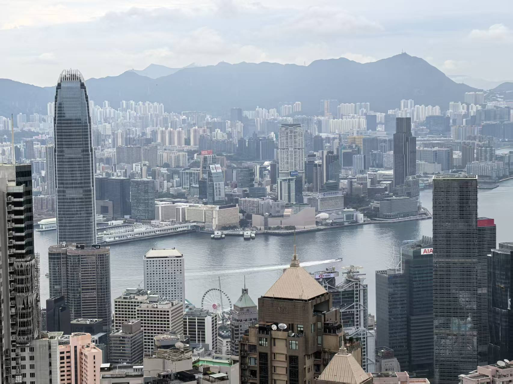
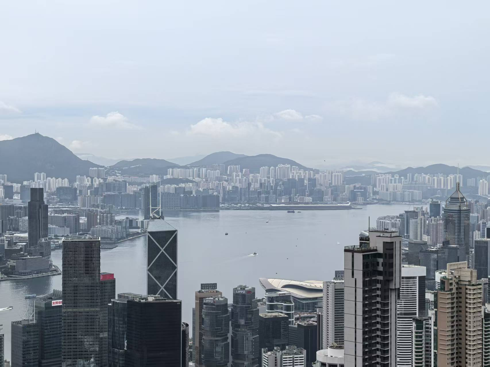

香港是一座需要用脚步慢慢读懂的城市。

它的故事不只写在维多利亚港璀璨的天际线上，也藏在旺角密密匝匝的招牌之间，藏在油麻地斑驳的旧楼里，藏在皇后大道匆匆流动的人群中。它有玻璃幕墙反射出的冷冽光芒，也有街角小店里温暖而琐碎的烟火气；有太平山顶俯瞰全城的辽阔，也有狭窄街巷里人与人擦肩而过的亲密。

我在香港停留了三天。三天很短，短得不足以真正了解一座如此复杂的城市，却又足够让我记住它的光线、声音、气味和天气。那些记忆并没有按照行程表整齐地排列，而是彼此交叠：旺角的霓虹落进夜色，维港的浓雾漫过海面，莫奈的光影与吴冠中的水墨在脑海中缓缓重合，而太平山顶的风，则从旅程的最后一个下午一直吹进回忆深处。

后来再想起香港，我首先想起的不是某一栋地标建筑，而是这座城市不断变化的面孔。它在白天锋利，在黄昏柔软；在人群中喧闹，在海风里沉默；它像一部节奏极快的电影，也像一幅被水汽慢慢晕开的画。

## 第一天：在旺角与油麻地之间，走进香港的夜

抵达香港后的第一个下午，我去了旺角。如果说一座城市也有心跳，那么旺角大概就是香港跳得最快的地方。

刚走进街道，四周的声音便一层一层涌来。双层巴士从身旁缓慢驶过，红色出租车在路口穿行，行人随着交通灯的变化迅速聚拢，又在绿灯亮起的一瞬间向不同方向散开。商铺的音乐、车辆的提示声、街边的交谈声和脚步声混合在一起，构成一种几乎不会停歇的城市节拍。头顶的招牌密集地伸向街道，有些鲜艳明亮，有些已经被风雨磨去了最初的颜色。它们高低错落地悬挂在楼宇之间，把原本狭窄的天空切割成不规则的形状。

旺角的建筑并不刻意展示精致。旧楼外墙上留着时间的痕迹，窗式空调排列在狭小的窗户旁，晾晒的衣物在楼与楼之间轻轻摇动。地面上却始终充满活力：便利店、药房、餐厅和大大小小的商铺一家挨着一家，人群从狭窄的入口进进出出，生活像水一样填满了城市的每一道缝隙。这里的拥挤并不只是一种空间感，也是一种旺盛的生命力。香港把无数人的日常压缩在有限的土地上，于是每一层楼、每一条街、每一个转角都承担着不同的功能。有人在这里生活，有人在这里工作，有人只是短暂经过。所有人的轨迹彼此交叉，却又奇妙地维持着一种熟练的秩序。

从旺角一路走向油麻地，城市的气质也在不知不觉间发生变化。两者之间没有一道清晰的分界线，却能感觉到街道逐渐沉静下来。旺角像一簇燃烧得正旺的火焰，明亮、密集、充满动势；油麻地则更像一本翻旧了的书，纸页泛黄，边角卷起，却保留着令人眷恋的温度。油麻地的旧楼更显沧桑。褪色的墙面、狭长的阳台、布满岁月痕迹的窗框，共同构成了许多人想象中的“老香港”。然而真正走在其中，才会发现这里并不是一处为了怀旧而保留的布景。它仍然属于鲜活的日常：街坊从店里提着东西出来，老人缓慢走过路口，店员站在门边招呼客人，楼上的窗户透出电视的声音。

电影中的香港总带着传奇色彩，而现实里的油麻地更加细碎，也更加动人。那些被无数镜头拍摄过的旧街景，并没有停留在过去。它们一边老去，一边继续容纳新的生活。楼宇的墙面或许已经斑驳，街边的招牌却仍在亮起；旧式店铺旁边开出了新的小店，穿校服的年轻人从年迈的街坊身边经过。过去与现在没有彼此取代，而是挤在同一条街道上，共同呼吸。

离开油麻地后，我来到维多利亚港。走出密集的街区，眼前忽然变得开阔。狭窄街道带来的压迫感一下子退去，取而代之的是海面、天空和从远处吹来的风。维港像一块巨大的留白，将两岸紧密排列的高楼轻轻分开，也让这座总是向上生长的城市，终于拥有了可以舒展的空间。

隔着海望向对岸，摩天大楼沿着海岸线铺展开来。阳光落在玻璃幕墙上，反射出冷而明亮的光。船只缓慢驶过，在水面留下一道道细长的痕迹，随后又被波浪悄悄抹平。站在海边时，我忽然意识到，维多利亚港之于香港，不只是一个著名的景点。它更像这座城市的一次呼吸。街道太密，楼宇太高，人群太急，只有到了海边，视线才终于能够越过眼前的一切，抵达远方。那些在城市内部显得高大、冷峻、不可接近的建筑，隔着海再看时，反而变成了天际线上安静的轮廓。

随后，我来到了香港理工大学。红砖建筑带来了截然不同的视觉感受。相较于旺角自然生长般的拥挤街区，校园显得理性、整齐而克制。几何形状的建筑、相互连接的走廊与层次分明的空间，像是城市喧嚣中一段短暂而稳定的停顿。但校园并没有与香港完全隔绝。远处依然是车流和楼群，城市的声音也会越过围墙传来。它只是暂时把那些声音放低了一些，让人在旅途的奔走之间获得片刻安静。

夜幕落下后，我重新回到油麻地和旺角。同一片街区，在白天与夜晚之间仿佛完成了一次无声的变身。天空的颜色逐渐变深，街边的灯光一盏接一盏亮起。白日里略显陈旧的外墙退入阴影，招牌和橱窗则开始成为街道真正的主角。红色、蓝色、绿色与暖黄色的光相互重叠，落在行人的脸上，也映在被雨水和车轮磨得发亮的路面上。

夜晚的油麻地有一种含蓄的电影感。灯光并不铺张，许多街道甚至显得昏暗。旧楼的窗口零星亮着，楼下的店铺透出温暖的光，人影从门前一闪而过。抬头时，建筑沉默地立在夜色里，密密麻麻的窗户仿佛收藏着无数互不相识的人生。旺角的夜则更加炽烈。人群依然没有散去，甚至比白天更加密集。巴士亮着灯从街道上经过，商铺的招牌高悬在头顶，路口的人潮不断汇聚，又不断分流。整座街区像一片由灯光组成的海，人们在其中穿行，每个人都只是转瞬即逝的一道影子。

香港最著名的夜景常常与维多利亚港联系在一起，但旺角和油麻地的夜色同样令人难忘。港口的夜景是宏大的，是供人远望的；而街巷中的夜景却离人很近。灯光贴着旧楼亮起，招牌悬在头顶，车辆擦身而过，陌生人的衣角掠过视线。你不是站在远处观看夜景，而是直接走进了夜景之中。

## 第二天：艺术馆里的光，维多利亚港上的雾

第二天下午，我去了香港艺术馆。这一天，我看到了克劳德·莫奈与吴冠中的作品。

莫奈的画总让人想到时间。他描绘的似乎并不是某一个固定的景物，而是光线落在景物上的那一瞬间。水面、天空、树影与雾气彼此渗透，清晰的边界被柔和地消解。色彩不是安静地停留在画布上，而是在观看者的目光里轻轻颤动。走近时，能够看见颜料留下的笔触；退后几步，那些看似零散的色块又渐渐汇聚成空气、波光和远方。景物仿佛并没有被完整地画出来，而是正从一片流动的光中缓慢浮现。莫奈笔下的世界没有坚硬的轮廓。万物都在变化：清晨的雾会散去，水面的光会转暗，花朵会随着季节开放，又在风中凋谢。他画下的，是时间停留在世界表面的痕迹。

吴冠中的作品则是另一种流动。黑色的线条在画面中穿行，时而浓重，时而轻盈；大片的白像水、像雾，也像未经言说的情绪。那些江南屋舍、枝叶、桥梁与河流经过提炼后，不再只是具体的风景，而成为富有节奏的点、线与色块。他的画既有中国水墨的气韵，也有现代绘画的构成。黑、白、灰之间偶尔跃出明亮的红、黄、绿，像寂静中突然响起的一枚音符。看似简洁的画面里藏着丰富的层次，疏与密、虚与实、轻与重彼此牵引。

如果说莫奈捕捉的是光线如何让世界变得朦胧，那么吴冠中更像是在研究，怎样用最少的笔墨唤起最辽阔的想象。在同一个下午看他们的作品，是一种奇妙的体验。一个来自遥远的法国，在光与色中追逐不断消逝的瞬间；一个从中国传统出发，在水墨与现代形式之间寻找新的道路。两人的语言并不相同，却都让风景超越了风景本身。水面不只是水面，雾也不只是雾，它们可以成为时间、记忆与情感的容器。

看完展览后，我走到能够望见维多利亚港的地方。窗外的景象让我停住了脚步。那天的维港没有明亮的阳光，也没有清晰锐利的天际线。浓雾正从海面上缓缓升起，台风带来的水汽与风将整座港口笼罩其中。远处的高楼隐去了顶部，只剩下若隐若现的轮廓；更远的建筑几乎完全消失，仿佛被一只无形的手从城市中轻轻擦去。

海面呈现出一种沉静的灰色，天空与水之间的界线变得模糊。偶尔有船只从雾中出现，缓慢驶过视野，又逐渐消失在另一侧。原本坚硬、挺拔的香港天际线，在这一刻失去了锋芒，变得柔软而遥远。

眼前的景象与刚刚看过的画作发生了奇妙的重叠。维港仿佛忽然进入了莫奈的画布。光线被水汽揉碎，建筑只留下朦胧的色块，远近之间没有明确的边界，一切都处在将要浮现又将要消失的状态里。它也像吴冠中笔下的一幅水墨。深色的建筑成为错落的墨点，海面与天空则化作大片灰白的留空。浓雾并没有遮住风景，反而重新安排了风景：有些东西被隐藏，有些轮廓被强调，而没有被看见的部分，恰恰留下了更广阔的想象。

艺术馆的玻璃将人与风雨暂时分开。我站在室内，看雾一点点漫过维多利亚港，忽然觉得现实与绘画之间并没有那么遥远。画家将自己看见的世界变成画，而天气也在窗外作画。风是看不见的笔，雾是不断晕开的颜料，海面是一张辽阔而沉默的画布。香港那些标志性的建筑，则在这幅画里时隐时现，成为一种不稳定的存在。

许多人来到维多利亚港，期待看到最经典的香港：晴朗的天空，清晰的楼群，入夜后沿海岸铺展开来的万家灯火。我看到的却是一座被浓雾隐藏起来的香港。它并不完整，甚至不够“标准”，却因此更接近一次无法复制的相遇。晴朗的维港或许每天都有人拍摄，而那一天下午的雾只属于那一阵风、那一片云和那一刻的海。

旅行真正珍贵的，往往不是终于看见了期待已久的景象，而是在计划之外，遇见了世界偶然显露的另一张面孔。

第二天的香港不再只是热闹与繁华。它变得安静、潮湿、含蓄，像一句没有说完的话，也像一封被雾气打湿的信。

## 第三天：穿过中环的锋利光影，登上太平山顶

第三天上午，我来到维多利亚港的对面，中环。登上摩天轮，将两岸风景尽收眼底，突然有一种“一览众山小”的气势。

深入中环，来到皇后大道。这里是香港另一种意义上的中心。

如果说旺角和油麻地展现的是城市贴近地面的生活，那么中环一带则让人看见香港向高处生长的野心。写字楼、银行、酒店与商场在有限的空间里紧密排列，巨大的玻璃幕墙把天空切割成明亮的碎片，又将四周的建筑层层反射。

高楼遮住部分天空，阴影覆盖着路面，而另一侧的玻璃外墙却亮得近乎耀眼。人在楼宇之间行走，显得格外渺小。皇后大道上的人群与旺角不同。这里的脚步同样迅速，却少了几分喧闹，多了几分克制。衣着利落的人们穿过路口，手里拿着咖啡、文件或手机，很快消失在写字楼的入口。车辆沿着道路驶过，电车轨道、天桥、斜坡与街道交织在一起，构成一套复杂而高效的城市系统。

香港是一座立体的城市。道路不仅存在于地面，也延伸到半空。天桥连接着写字楼与商场，扶梯把人从一层送往另一层，楼梯和坡道在建筑之间不断转折。有时走了很久，再回头才发现，自己早已离开原来的街面，悬在车流与楼群之上。这种立体感既来自地形，也来自香港对空间近乎极致的利用。山与海限制了城市的边界，于是人们向上修建，把道路、商业、交通与生活一层层叠加。香港不是铺展在大地上的，而像是从狭窄的海岸线上生长出来的。

随后，我走进国际金融中心商场。商场内部明亮、洁净，带着一种与外面街道截然不同的秩序感。玻璃、金属与浅色墙面共同构成冷静的空间，灯光均匀地落下来，隔绝了户外潮湿的空气与嘈杂的车流。巨大的落地窗又把城市重新带回视野。透过玻璃，可以看见港口、道路与层层叠叠的楼宇。人们在室内喝咖啡、购物、交谈，窗外则是不断运转的香港。在这里，商场并不只是一个独立的消费空间。它更像城市交通网络的一部分，与地铁、写字楼和天桥彼此连接。人们可以从一栋建筑进入另一栋建筑，经过商场与走廊，再抵达完全不同的街区，而不必始终回到地面。

香港把流动本身变成了城市生活。

下午，我前往太平山顶。上山的过程像是将白天走过的街道逐渐折叠起来。随着高度上升，近处的楼宇慢慢退到脚下，原本被建筑遮挡的海港也一点点展开。那些在地面上显得巨大而压迫的摩天楼，此刻缩小成密集的几何形状。

站在山顶俯瞰香港，才终于看见这座城市完整的地理轮廓。港岛的高楼紧贴着山脚生长，维多利亚港从城市中间铺开，九龙在海的另一侧延伸。楼群像一片由钢筋、水泥和玻璃构成的森林，而海水则在两岸之间留下深色的间隔。船只在港口缓慢移动，从高处看去，小得像散落在水面上的白点。

山顶的风比城市里更直接。它越过树林和栏杆，带着海上的湿润气息迎面而来。雾依旧没有完全散去，远处的建筑被笼罩在淡淡的灰白之中。城市的边缘不再清晰，山、海、天空与楼群沿着视线逐渐融为一体。

从太平山顶看香港，会产生一种奇妙的错觉。在地面行走时，城市庞大得仿佛没有尽头。街道一个接着一个，楼宇遮挡着楼宇，人群从四面八方涌来，很难找到真正的边界。可当我站在高处，那些令人迷失的街道忽然有了秩序，摩天大楼也变得安静。

曾经身处其中时感受到的拥挤、喧哗与匆忙，此刻都被距离轻轻抚平。中环不再只是金融与商业的象征，旺角也不再只是一片耀眼的霓虹。它们共同构成脚下这座复杂的城市，在山与海之间紧紧相依。

也许俯瞰一座城市时，人总会产生某种温柔。因为距离让我们暂时忘记它的棱角，只看见灯光、海岸与建筑组成的整体。那些独自生活在无数窗口后面的人，那些发生在街巷里的悲欢，那些匆匆开始又结束的故事，都被收进同一片风景之中。

我站在太平山顶，回望这三天走过的香港。

第一天，我在旺角和油麻地的人潮中感受它的温度；第二天，我隔着艺术馆的玻璃，看见它在浓雾中变得柔软；第三天，我终于站到高处，看见这座城市如何依靠着山，又面对着海。

三天的行程，也像是三种观看香港的方式。第一天，我走进它的街道。第二天，我透过艺术与天气凝视它。第三天，我站在远处，试着看见它的全貌。

## 离开以后，香港仍在记忆中发光

旅程结束后，许多具体的路线或许会渐渐模糊，真正留下来的，往往是一些无法准确标记在地图上的瞬间。

我会记得旺角头顶层层叠叠的招牌。它们遮住天空，却点亮了街道。我会记得油麻地旧楼上的窗户。白天看起来平凡甚至陈旧，到了夜里，每一扇亮起的窗都像一个尚未讲完的故事。我会记得维多利亚港的海风，以及站在海边时突然开阔的视野。身后的城市仍在喧闹，眼前的水面却把一切声音带向远方。我也会记得皇后大道上被高楼切割的光影，国际金融中心商场里明亮而克制的玻璃空间。

当然，我最难忘的，仍然是第二天下午偶遇一场猝不及防的台风。

那片雾让熟悉的维港变得陌生，也让艺术馆里的画与窗外的现实短暂相连。莫奈画布上流动的光，吴冠中笔下辽阔的留白，都在那片灰色海面上找到了回应。雾遮住了一部分香港，却让我看见了另一部分香港。这座城市常常以速度、效率和繁华示人。它的高楼轮廓鲜明，夜景璀璨夺目，街道永远人潮涌动。然而当浓雾落下，建筑的边界被一点点抹去，香港也会显露出柔软、朦胧，甚至略带忧郁的一面。

三天当然不足以读完香港。而属于这三天的香港，将永远停留在浓雾、海风与霓虹交织的时刻——潮湿，明亮，拥挤，华丽，又带着一点无法被完全说清的忧伤。