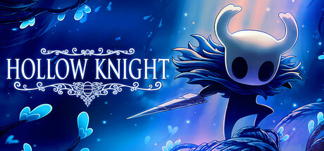
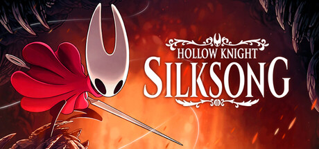
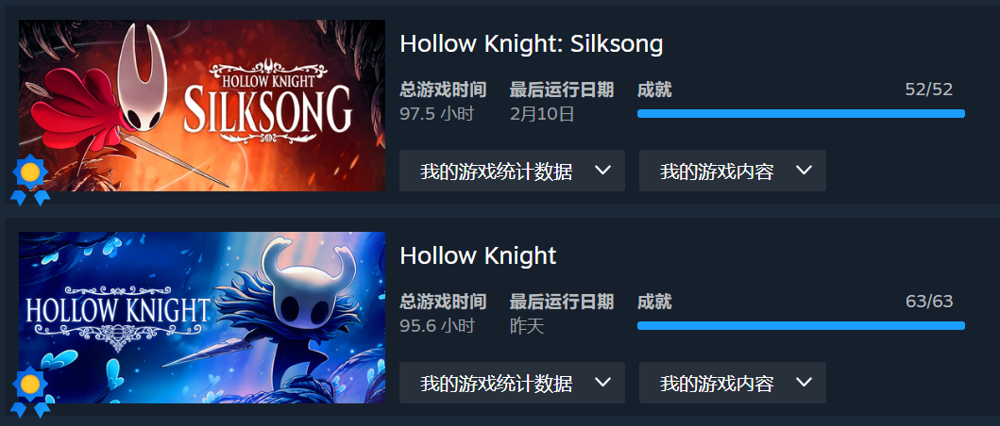

2月10日，在断断续续的玩了五个月之后，丝之歌终于全成就，纺都之旅告一段落。《空洞骑士》与《丝之歌》，作为 Team Cherry 十几年的心血，已经成为类银河战士恶魔城这一游戏类型中最高的山与最长的河。

## 一、传奇故事的开幕：圣巢

游玩【空洞骑士】过程中最令我印象深刻的三个场景，它们也分别对应三段最经典的文本：

**1.泪水之城**

从泪水之城坐电梯往下，随着bgm响起，映入眼帘的是雨中的泪城左城，感觉豁然开朗，柳暗花明，往前一直走到空洞骑士的纪念雕像处，bgm来到最高潮，神圣感和庄严感一下子具象起来，在这一刻，小骑士也更具使命感与责任感。（纪念【空洞骑士】：在那高远的黑色穹顶下，它的牺牲使圣巢永世不衰。）

**2.深渊**

从面具堆中爬出缓慢向上跳，bgm越来越悲壮，最后见到白王与前辈，前辈回头的那一刻，就已经注定它不再存粹。这一段画面也诞生了整个游戏最精彩的文本（没有可以思考的心智。没有可以屈从的意志。没有为苦难哭泣的声音。生于神与虚空之手。你必封印在众人梦中散布瘟疫的障目之光。你是容器。你是空洞骑士。）

**3.安息之地&蓝湖**

安息之地的bgm情感层次丰富，极具氛围感。静穆的哀悼，永恒的安眠，星空的低语，稀疏与留白，完美诠释了悲与美的结合。蓝湖旁，奎若在这里道出了最引人深思的话（我忘记了所有悲剧，看到的都是奇迹......）

## 二、织者永恒的史诗：纺都

从苔穴一路螺旋向上，见证最底层的贫民窟、中层诡异的钟心镇、上层外表繁荣，内心空虚的圣歌城堡，在最顶层摇篮圣所战胜丝母后又下到最深处深渊战胜失心蕾丝，途中还爬过费耶山、下过岩浆池、穿过风沙地、淌过腐汁泽......完全可以说是昆虫版八十一难。一路上的艰难让主角大黄蜂从只是想一探究竟转变为拯救这个被丝咒侵袭的国家。印象最深的当然是深渊决战前大黄蜂说的最后一句话：我熬过了纺络的无数荆棘，也在危机中见证过奇迹。但我永远是圣巢之女，对万物之底的虚空......再无畏惧！

**1.甲木林（壳木林）**

2025年9月4日第一版丝之歌的中文翻译是叫甲木林，后面改成了壳木林。

第一幕初到甲木林，觉得这里就像空洞骑士里面的苍绿之径，静谧是最大的特点。后面第三幕再来的时候，觉得这里像空洞骑士里面的王后花园，幽静而深邃。bgm感觉像是有魔力一样，第一幕来的时候就只是静谧，第三幕再来的时候感觉多了一层诡异与幽深，瞬间感觉这个图不一般，巧妙融合了一代苍绿之径和王后花园两张地图。

**2.腐汁泽&腐殖渠**

腐汁泽一定是游戏史上最“味”大的一张地图。这两张图让我印象深刻的原因纯粹是因为太恶心了。小怪恶心、复活点少、地图阴暗、氛围恐怖、超多陷阱、蛆水恶心、BOSS战前还有小怪连战、BOSS战恶心、BOSS战离复活点超远、所有怪不掉钱、甚至还有一个假的复活点！太恶心了！唯一稍微好点的就是bgm不错。但玩完之后就像空洞骑士里的那句话一样：我忘记了所有悲剧，看到的都是奇迹。这句话才是 Team Cherry 的游戏最核心的特色。质量高的能让你原谅他往里面塞的恶意。

**3.卡拉卡沙川&珊瑚尖塔**

第二幕的时候打开地图，发现蚀阶最左边还有一片黑没探索，过去之后发现是满屏的风沙。但我偏偏不觉得这里没有隐藏小路，一路往左上走，没想到真的找到隐藏通道，来到一个全新的地图卡拉卡沙川。这里原来是由壳王卡汗统领的珊瑚尖塔，但是由于圣堡的一系列作恶，导致这里水枯石栏，从生机勃勃的大海变成现在黄沙漫天的石窟。第三幕壳王梦境中曾经的珊瑚尖塔还是十分震撼的，可惜这个图似乎在 Team Cherry 开发过程中废弃了，只留下了一小部分内容。

完全体大黄蜂的性能可比小骑士强太多了，樱桃这7年的开发时间不仅在认真写代码，还把技术锻炼的炉火纯青，在这么强大的技能模组下还能设计出让玩家觉得困难的BOSS。另外，本作的美术在一代的基础上登峰造极，虽然玩的时候绝大多数时间都因为高压的战斗而没注意地图设计的细节与背景音乐，但平静下来就会发现，丝之歌的美术确实无与伦比。

当然，没有十全十美的游戏，但我认为本作已经相当完美了，唯一美中不足的就是第一幕的念珠太少太少了，第一幕能买的东西也不少，但打怪掉落的念珠太少了，导致我每一个档都要在第二幕的圣堡中刷钱。如果技术差一点，死亡次数多的话，那念珠就更少了，第二幕都不够用。

## 三、人民的樱桃：用心做游戏

空洞骑士自发售以来，陆续更新了生命血、隐藏的梦、格林剧团、寻神者4个DLC，又在今年2月修复了游戏的一些小问题，这种体量58块的价格已经不能用便宜来形容了，简直就是做慈善，不，扰乱市场！樱桃之前说，丝之歌本来是打算做成空洞骑士的DLC免费发布，但是团队在开发过程中灵感爆发，不断往里面加新东西，最后由于体量太大，干脆做成空洞骑士的续作独立发布了。同样，以丝之歌的体量，76块的价格绝对物超所值。正常游玩的话一周目差不多需要40小时，100%全收集差不多60小时，太对得起这个价格了。去年年底樱桃甚至还发布了消息，说丝之歌的免费DLC正在制作中，简直太良心了。

两款游戏的质量非常过硬，放在类银河战士恶魔城这一类别中都是冠绝群雄的存在。Team Cherry 真的是在用心做游戏。樱桃已经完全沉浸在自己的艺术中了。