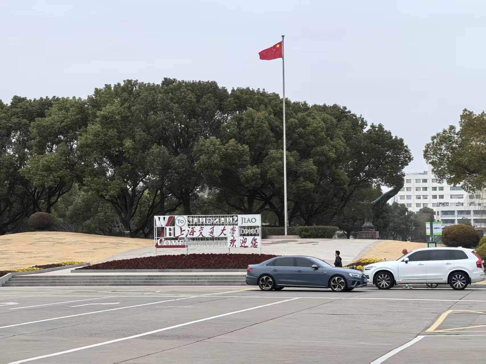
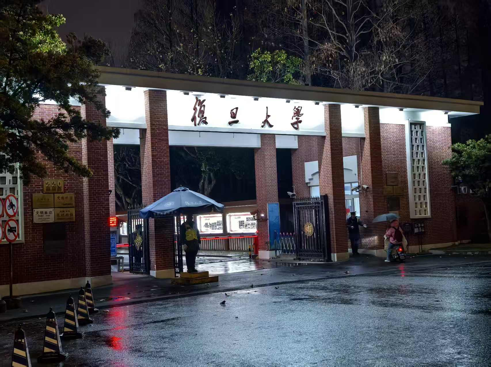
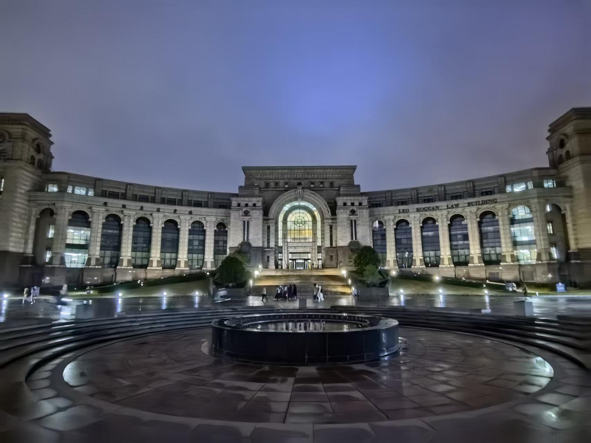
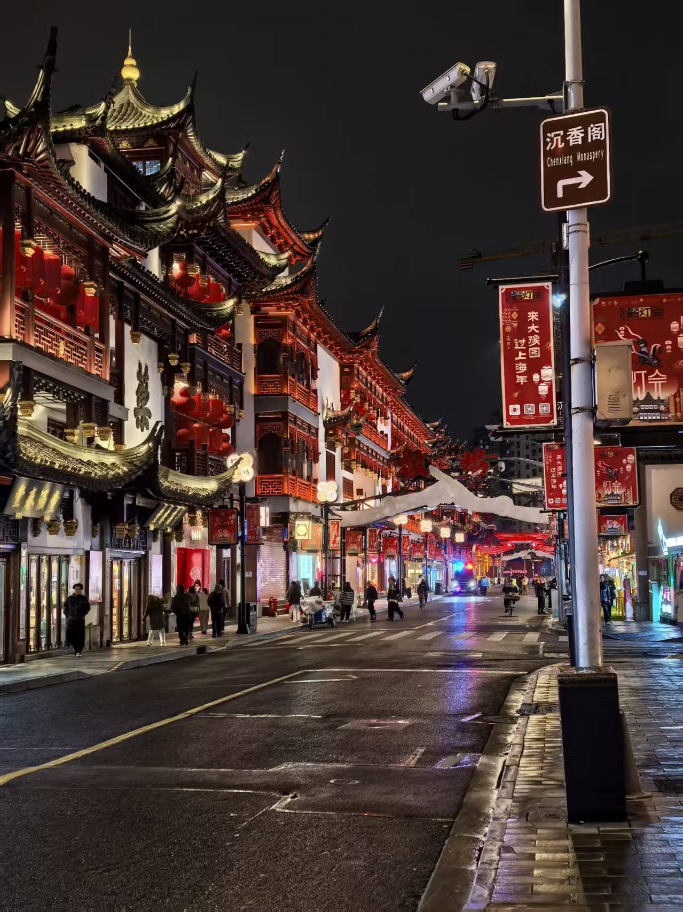
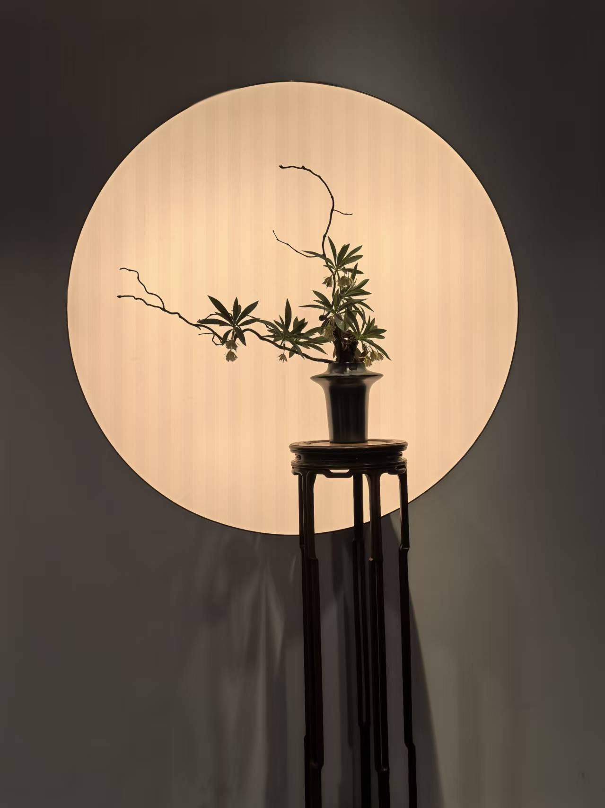
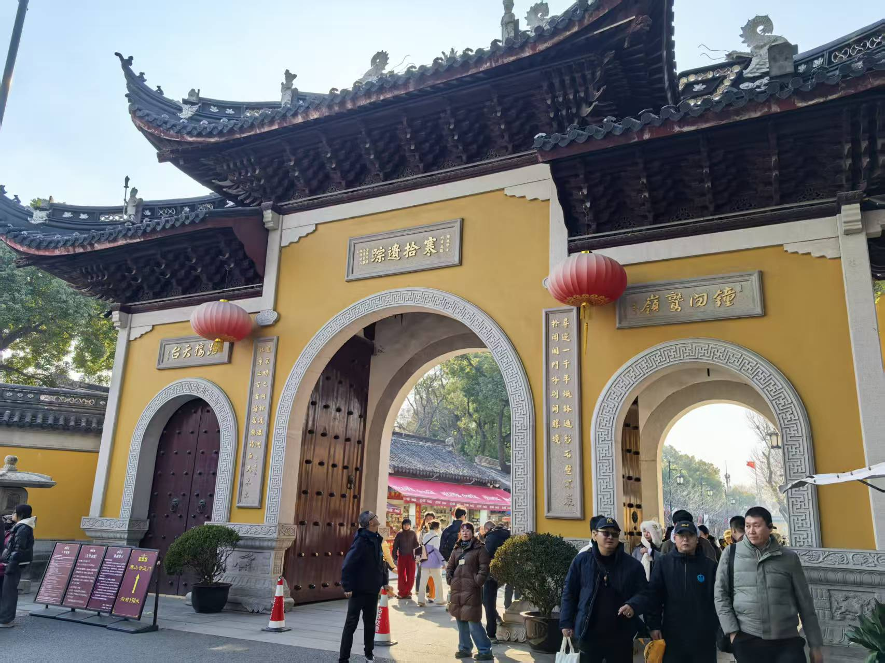
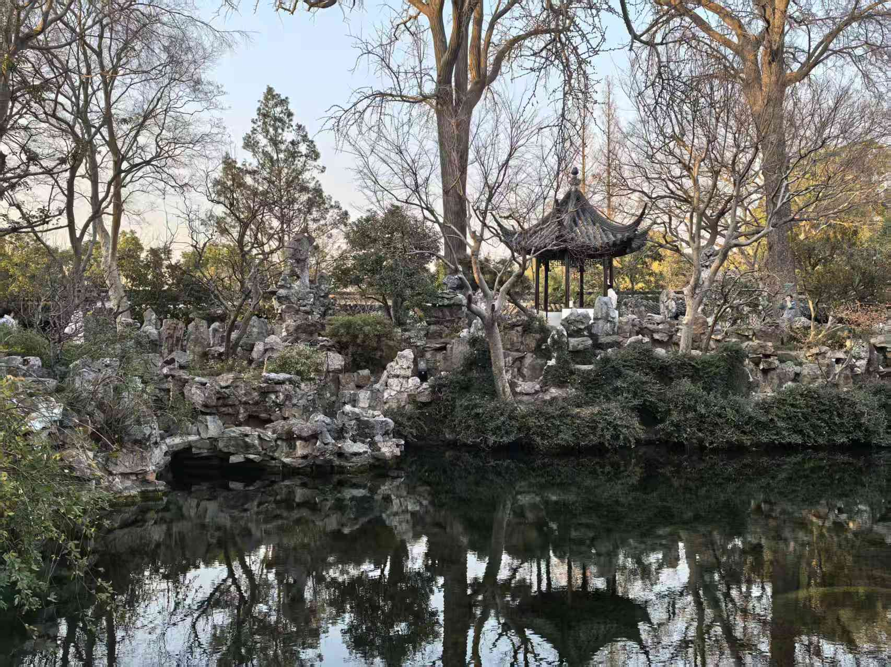
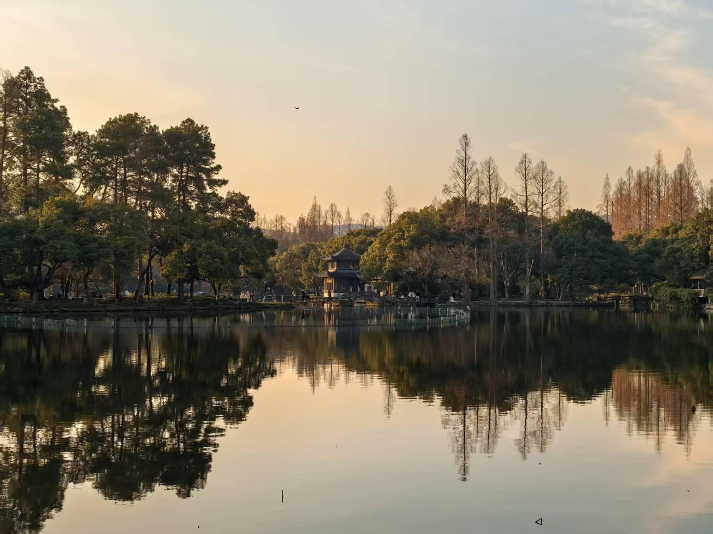

俗话说“上有天堂，下有苏杭”，趁着寒假与旅游淡季，我打算和朋友一同前往长三角，去体验鳞次栉比的魔都上海，曲径通幽的苏州园林，烟波浩渺的杭州西湖。我们1月17日从广州白云机场出发，于18日凌晨抵达上海浦东国际机场。

## 第一站：上海交通大学（闵行校区）

首先我们来到了上海交通大学。学校创立于1896年，上交的实力想必不需要我过多介绍了。正好我有一个朋友在上交，所以我们就让他来带领我们参观这所享誉全球的世界名校。

极具创意的路标：以上海的位置为起始点，伦敦、斯德哥尔摩在西边；香港、台北、悉尼在南边；旧金山在东边；北京在北边。

坐落在思源湖畔的包玉刚图书馆，为纪念捐资兴学的香港船王包玉刚先生，于1992年其逝世后命名。

还有植物园、李政道图书馆、插画馆，以及刚刚被拆分的电院。

冬天的交大似乎有一点单调，街道两旁的树光秃秃的，但这丝毫不影响我对交大的向往。

校训：**饮水思源，爱国荣校**

中午在校内一家西餐厅吃的午饭，物价确实有一点贵。晚上在学校附近龙湖新街的一家铁板烧，这个就更贵了，一整天仅吃喝就花费了近200块。

2024年高考没能考上的梦校。

## 第二站：复旦大学（邯郸校区与江湾校区）

下一站来到了上海另一所顶级高校复旦大学。当天下着小雨，所以拍出来的照片可能会影响观感，但依然影响不了我对复旦大学的景仰。同样，也有一个朋友就读于复旦大学，于是便请他来带我们参观。

复旦大学邯郸校区，感觉就像被几条校外道路“切碎”了一样，非常松散。一个校区内又可以划分为南区、北区、东区，朋友介绍北区的食堂最好吃，东区的食堂最具性价比，于是便让他带我们去北区食堂，确实好吃，在经历了前一天的超高消费后再次看到18块钱的一份滑蛋牛肉饭，觉得这个价格是格外的亲切。

2005年复旦大学百年校庆之际建成的光华楼：

江湾校区是新建校区，里面除了法学院，都是研究生。不得不说，新校区确实非常气派，整体统一的建筑风格，规划合理的道路十分清爽。

廖凯原法学楼，与光华楼追求宏大象征不同，法学楼的设计更侧重于庄重感，体现了法学院严谨务实的学风。

一边走着，朋友讲起了上海地铁站名与“大上海计划”。乘地铁到达复旦大学的过程中，可以发现地铁站名很多是以“民”、“国”、“政”、以及一些城市命名，比如“国权路”、“南京南路”等等。计划的精华在于市中心行政区。这里汇聚了一批采用中国古典复兴式风格的建筑，由建筑师董大酉主持设计。它们以钢筋混凝土为结构，却覆以重檐歇山顶，体现了“民族自强”的精神。

## 第三站：上海外滩、豫园

从复旦大学回酒店的途中，顺路去看了一下外滩。2021年4月5日，高中研学活动曾来过这里，当时还有外国人主动过来找我合影，印象深刻。现在时隔近五年再次来到上海最繁华的地带，依旧是气势恢宏，流光溢彩。

让我沉浸在奢华的幻想中......

步行十几分钟，来到豫园。江南古典园林的代表，与现代化的陆家嘴形成鲜明对比。它既是安静的古典园林，又是活态的文化商业区，能一站式体验上海的传统与现代。

## 第四站：苏州博物馆、拙政园

离开上海，我们来到了苏州，一座将“古韵”与“今风”编织在一起的双面绣城。

早就听闻苏州园林的大名，今天便来参观江南园林的老大哥--拙政园。正好苏州博物馆就在旁边，于是就先去博物馆。

苏州博物馆由建筑大师贝聿铭先生设计，将江南园林的白墙黛瓦、几何线条与现代光影完美融合。里面陈列了不少奇珍异宝，包括吴王夫差剑、各种陶瓷、各种文人书画，还有各种奇石、古物。

苏州博物馆还专门搞了几个适合拍照的点：

在窗户前面加一块幕布，这样透过幕布拍窗外景，有一种水墨画的意境。

透过幕布拍摄苏州博物馆：

从苏州博物馆出口离开，到了太平天国忠王李秀成的府邸（忠王府），里面记录着太平天国运动的一切信息。

之后我们来到了博物馆旁边，大名鼎鼎的苏州园林之最，拙政园。

拙者之为政也。著名画家文徵明曾参与设计，全园以水为中心，亭台楼阁依水而建，一步一景，移步换景。

可惜冬天的时候树叶已经落光，略显萧条，好处就是人比较少，更能体会园林本身的意境。

在倚虹亭望北寺塔：

水中倒影：

## 第五站：寒山寺、留园

姑苏城外寒山寺，夜半钟声到客船。张继这首《枫桥夜泊》，与苏州城的文化脉搏一起跳动了千年。

留园，与拙政园并称苏州园林“双璧”，亦是“中国四大名园”之一。

## 第六站：西湖

在苏州玩了几天之后，我们又来到了杭州，来欣赏西湖的景色。

划船行于西湖上：

水中倒影：

雾凇沆砀，天与云与山与水，上下一白。

冬日的西湖，少了几分人声嘈杂，多了几分宁静和谐。

## 尾声

1月17日启程，23日返程，24日完成博客。

沪：**珠履往来皆胜景，荧屏变幻即华篇。**

苏：**会心何必在郊坰，近圃分明见远情。**

杭：**水光潋滟晴方好，山色空蒙雨亦奇。**
